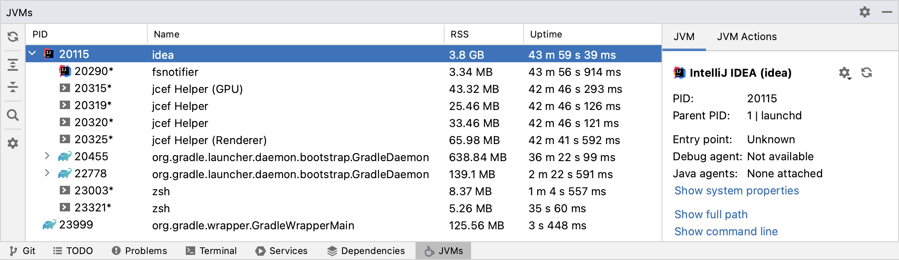
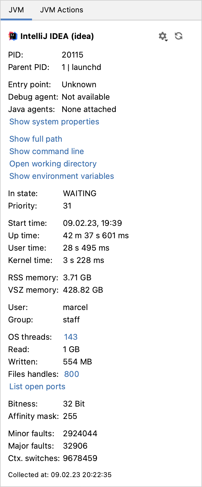
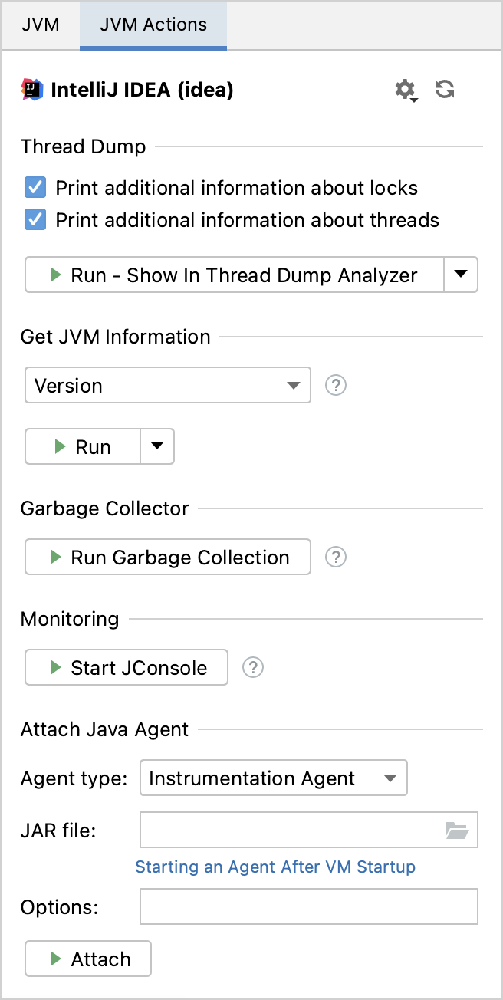

# IntelliJ JVMs Manager Plugin

This IntelliJ plugin provides a task-manager-like tool window to monitor and manage Java Virtual Machines.

[**It's available on the official IntelliJ plugin marketplace**](https://plugins.jetbrains.com/plugin/19464-jvms-manager).

The tool window is available via *View | Tool Windows | JVMs* and will be shown by default in the left bottom of IntelliJ.

([Plugin icon by svgrepo.com](https://www.svgrepo.com))

## Features

### List All Running JVMs

The main part of the tool window is a tree table that lists all running JVM processes and their child processes.

### Process Details

For each JVM process the process details contains information about the main class, attached debugger and Java agents, and system properties.

Besides that, the process details provides the memory usage, command line, environment variables, uptime, and a lot more.

### JVM Actions

The plugin provides an easy-to-use UI to access detailed information about any running JVM process, like getting a thread dump, version, classloader hierarchy, and the heap space. In addition, the tool window provides a one-click solution to attach a Java agent, trigger the garbage collection and start the OpenJDK JVM monitoring tool.

## Development

This plugin is not seen as a library. Therefore, code changes do not necessarily adhere to the semantics version rules.

If you want to contribute something, please follow the code style in the `.editorconfig` and sign your commits.

## License

Copyright (c) 2022 Marcel Kliemannel

Licensed under the **Apache License, Version 2.0** (the "License"); you may not use this file except in compliance with the License.

You may obtain a copy of the License at <https://www.apache.org/licenses/LICENSE-2.0>.

Unless required by applicable law or agreed to in writing, software distributed under the License is distributed on an "AS IS" BASIS, WITHOUT WARRANTIES OR CONDITIONS OF ANY KIND, either express or implied. See the [LICENSE](./LICENSE) for the specific language governing permissions and limitations under the License.
